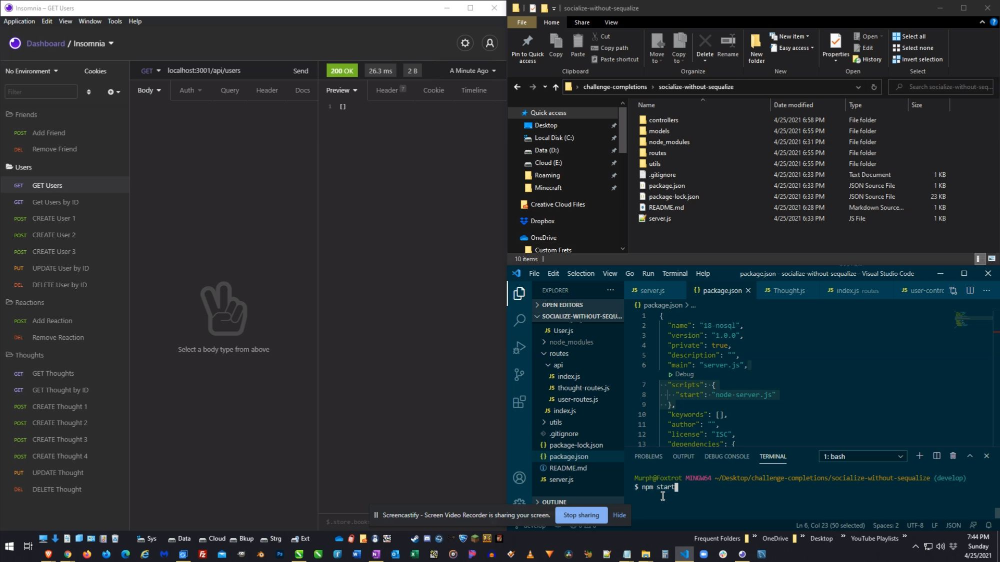

# Socialize Without Sequalize

## Description

This repo containes a nodejs, express and mongodb based backend API that sets up a NoSQL based social app framework.

## Table of Contents

* [Installation](#installation)

* [Usage](#usage)

* [Credits](#credits)

* [License](#license)

 

* Social Network API based on a NoSQL structure
* Allows for users to engage with friends through thoughts and reactions
* Sets up CRUD functionality for all user, thought, and reaction handling

 

This backend social networking database is great for building communities and starting conversations.

 

***

## Installation

To run Socialize Without Sequalize, you can copy/clone/fork this repository. Make sure to install the mongoose ODM and express.js framework libraries and have MongoDB installed. Use "npm init" to intialiaze the package manager followed by "npm install {dependency}". This will setup the necesary packages required.

***

## Usage

This database is intended to be used in conjunction with a social networking application to store user information such as username, email, thoughts, reactions, and friends.

[SWS Video Demo 1](https://drive.google.com/file/d/1SmI09ybSvgfiDYjyn32IyKyCC7OwOXuc/view)

[SWS Video Demo 2](https://drive.google.com/file/d/1xyIjPOAh6fKZeVVA6sBBY9RVM6KM6XkD/view)

 

***

## Credits

W3Schools for always being there | 
[W3Schools](https://www.w3schools.com/)

 

***

## License

All Rights Reserved.
